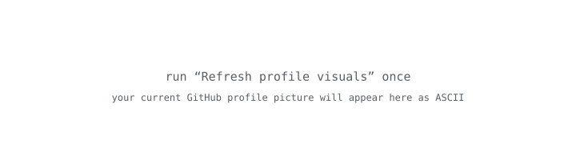
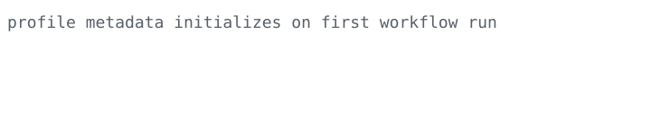

  

  

---

### build

`security` · `privacy` · `systems` · `automation` · `product`

I build things that are meant to survive contact with reality.

### current

- Replace this line with your main project.
- Replace this one with what you are exploring right now.
- Keep this profile sparse: a few strong projects are better than a wall of badges.

### projects

**Project One** — one sharp sentence explaining why it matters.  
**Project Two** — one sharp sentence explaining what makes it different.  
**Project Three** — one sharp sentence explaining what you actually built.

---

The portrait is generated from the current GitHub profile picture by this repository's GitHub Action.
Change the profile picture on GitHub and the ASCII portrait follows automatically on the next refresh.

